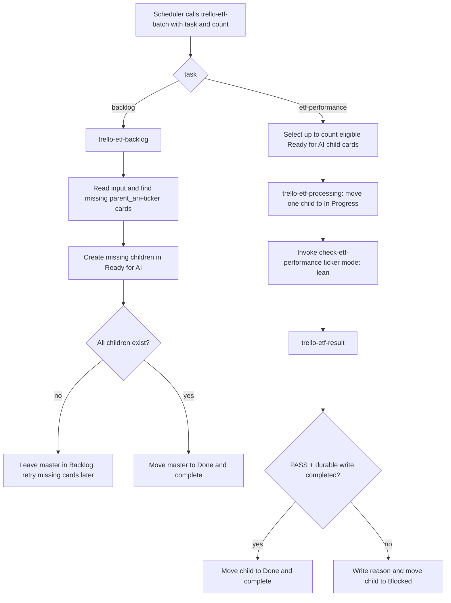

# Trello ETF Skill Decomposition Design

**Date:** 2026-08-15  
**Status:** Draft for user review  
**Decision:** แยก workflow เป็น 3 skills เฉพาะงาน และใช้ `trello-etf-batch` เดิมเป็น Skill 4 manager/router

## Goal

แยกความรับผิดชอบของ Trello ETF workflow ให้แต่ละ skill ทำงานชัดเจนและทดสอบแยกกันได้ โดยยังคงให้ `check-etf-performance` เป็นเจ้าของการค้นคว้า การ review gate และ durable vault writes แต่เพียงผู้เดียว

## Scope and non-goals

อยู่ใน scope:

- แตก master card จาก `Backlog` เป็น child cards ราย ticker ใน `Ready for AI`
- claim และประมวลผล child card ทีละใบตามจำนวนที่ scheduler ระบุ
- ย้าย child card ตาม result ไป `Done` หรือ `Blocked`
- รักษา `parent_ari` เพื่อแยก batch ที่มี ticker ซ้ำกัน
- ปรับ `automation-prompt.md`, agent metadata และ static contract tests ให้ใช้ workflow ใหม่

อยู่นอก scope:

- ไม่แก้กฎ research, pre-save reviewer หรือ durable output ของ `check-etf-performance`
- ไม่สร้าง Trello automation ใหม่จาก skill
- ไม่ให้ Trello skills browse issuer/regulator/benchmark sources หรือเขียนไฟล์ vault
- ไม่สร้าง exception card แยกสำหรับ child ที่ fail เพราะ child card เองเป็นงานและ failure record อยู่แล้ว

## Components and ownership

| Skill | Responsibility | Input | Output |
|---|---|---|---|
| `trello-etf-backlog` | อ่าน master input และสร้าง child ที่ขาด | master card ใน `Backlog` | child cards ใน `Ready for AI`, master ไป `Done` เมื่อครบ |
| `trello-etf-processing` | claim child และเรียก downstream worker | child card ใน `Ready for AI` | normalized result envelope จาก `check-etf-performance` |
| `trello-etf-result` | เปลี่ยนสถานะ child ตาม result | child card + result envelope | child ใน `Done` หรือ `Blocked` |
| `trello-etf-batch` | route prompt และจำกัดจำนวนงาน | scheduler/user prompt | เรียก skills ข้างต้นตาม mode และ `count` |

`trello-etf-batch` จะไม่เป็นเจ้าของ checklist queue หรือ exception-card protocol แบบ monolith เดิมอีกต่อไป ความรับผิดชอบนั้นถูกแทนที่ด้วย child-card state และ `parent_ari + ticker` identity

## Card contracts

### Master card

Master card เป็นการ์ดที่ผู้ใช้สร้างใน `Backlog` และต้องมีอย่างน้อย:

```text
workflow: trello-etf-backlog
input: /absolute/or/project-relative/path/to/etf-list.md
```

`workflow: trello-etf-batch` ที่มี `input:` ใน `Backlog` จะรับเป็น legacy master configuration เพื่อให้การ์ดเดิม migrate ได้โดยไม่ต้องแก้มือทันที การ์ดในลิสต์อื่นจะไม่ถูกเลือกเป็น master โดยอัตโนมัติ

Skill 1 จะ resolve input เป็น Markdown table ที่มีคอลัมน์ `Symbol` หรือ `Ticker` เพียงหนึ่งชื่อแบบ case-insensitive, trim whitespace/backticks, normalize เป็น uppercase, คง source order และ deduplicate ครั้งแรกเหมือน contract เดิม ถ้า input หาย อ่านไม่ได้ malformed หรือไม่มี ticker จะหยุดก่อน Trello mutation ด้วย `input-malformed`

### Child card

ชื่อ child card เป็น ticker canonical เช่น `VIG` และ description ต้องมี metadata ขั้นต่ำ:

```text
workflow: trello-etf-item
parent_ari: <resolved master card ARI>
ticker: <CANONICAL_UPPERCASE_TICKER>
```

Identity ของ child คือคู่ `parent_ari + ticker` การ์ดที่ unarchived และมี identity เดียวกันในลิสต์ใดก็ตามถือว่าสร้างแล้ว จึงไม่สร้างซ้ำ การ์ดที่ถูก archive แล้วไม่นับเป็น child ที่ยังใช้งานอยู่และสร้างใหม่ได้

Child ที่สร้างใหม่ต้องอยู่ `Ready for AI` เสมอ Skill 3 จะเลือกเฉพาะ child ที่อยู่ในลิสต์นี้ การ์ดใน `In Progress`, `Blocked` และ `Done` จะไม่ถูกแย่งงานหรือ reset โดย manager

### Result envelope

Skill 3 ต้องส่งต่อ envelope ครบทุก field ให้ Skill 2:

```text
status: PASS|WARNING|CHANGES_REQUIRED|BLOCKED|ERROR
scope: item|global|unknown
durable_write: completed|not_completed|unknown
exhausted: true|false
confirmation: none|required|confirmed
code: <normalized-stable-code>
reason: <concise-one-sentence-reason>
```

Success ต้องเป็น `PASS`, `scope: item`, `durable_write: completed`, `exhausted: false`, `confirmation: none` และ success code (`success` หรือ `durable-write-complete`) เท่านั้น ผลอื่นทั้งหมดเป็น failure ของ child card; envelope ที่ขาด field หรือขัดแย้งกันใช้ `unknown-result` และมี reason ที่อธิบายความผิดพลาด

## Workflow sequence



## Skill boundaries and state rules

### Skill 1: backlog splitting

- Select only eligible master cards in `Backlog`.
- Build and validate the complete canonical ticker sequence before creating any child.
- Search by `parent_ari + ticker`; create only missing children.
- Continue attempting remaining missing tickers after an item-specific create failure and report each failure.
- Keep the master in `Backlog` while any child is missing; a partial create is not a global success.
- When every canonical ticker has an active child, move the master to `Done` and mark it complete.
- Do not inspect or alter child result state to decide whether splitting is complete; a `Blocked` or `Done` child still proves that the child was created.

### Skill 3: processing

- Accept one exact child card target at a time.
- Require the child to be in `Ready for AI` and validate `workflow`, `parent_ari`, and canonical ticker before claiming.
- Move the child to `In Progress`, directly re-read it, and continue only when the lane confirms the claim.
- Invoke `$check-etf-performance <TICKER>` with `mode: lean` exactly once for that child.
- Wait for the downstream research delegation, reconciliation, pre-save review, and durable-write result; do not reproduce those steps locally.
- Forward the complete envelope and any downstream links to Skill 2.
- A Trello claim/mutation failure must not invoke the downstream worker; return a global failure envelope for Skill 2.

### Skill 2: result routing

- Accept only the selected child and the normalized result envelope.
- On the strict success envelope, move the child to `Done` and mark it complete.
- On any failure, append/update `status`, `code`, `reason`, and relevant result fields in the child description while preserving `workflow`, `parent_ari`, and `ticker`, then move the child to `Blocked`.
- Do not mark a failed child complete and do not create a second exception card.
- If a Trello mutation fails, report `claim-state-error`/`trello-tool-failure` to the manager and stop the current run; do not claim that the state transition succeeded.

### Skill 4: manager/router

The scheduled prompt must provide a deterministic task and positive count:

```text
task: backlog|etf-performance
count: <positive base-10 integer>
```

`count` is required for scheduled runs. Invalid or missing values return `workflow-config-mismatch` without Trello mutation. The manager uses an in-memory `attempted_this_run` set so a master that remains in `Backlog` is not selected twice in one run.

- `task: backlog`: select up to `count` eligible master cards in `Backlog`, call Skill 1 sequentially, and never select the same master twice in the run.
- `task: etf-performance`: select up to `count` eligible child cards in `Ready for AI`, ordered oldest-first by last activity, call Skill 3 then Skill 2 sequentially, and never select a card twice in the run.
- Never select cards in `In Progress`, `Blocked`, `Done`, archived cards, malformed cards, or cards without the required identity.
- An accepted item-level ETF failure is isolated to its child: Skill 2 blocks that child and the manager can continue to the next selected card. A Trello/auth/board/list/configuration failure is global and stops the run.
- The manager does not create automations and does not browse or write vault files.

The manager must not schedule overlapping workers for the same board. `parent_ari` prevents cross-batch identity collisions, while the lane transition prevents two workers from processing the same child after selection.

## Compatibility and migration

Keep the existing skill name and entry point `$trello-etf-batch`, but rewrite its contract as the manager/router. Existing exact-parent batch prompts are not silently executed through the old checklist protocol. A legacy master card with `workflow: trello-etf-batch` and `input:` is accepted only by Skill 1 when it is in `Backlog`; users can migrate it by changing the workflow line to `trello-etf-backlog`.

Existing monolithic queue/checklist and exception-card text is not used as runtime state by the new skills. It remains historical text unless a future migration explicitly converts it to child cards. No skill deletes user configuration text.

## Verification strategy

Add focused static contract tests:

- `test_backlog_split_contract.sh`: input aliases, `parent_ari + ticker` identity, idempotent missing-card creation, partial-create continuation, master Backlog/Done transitions.
- `test_result_transition_contract.sh`: strict PASS to Done, all non-pass results to Blocked with reason, no exception child creation.
- `test_processing_contract.sh`: Ready-for-AI-only selection, claim before downstream, one ticker per call, and forwarding to Skill 2.
- `test_manager_routing_contract.sh`: task routing, required positive count, sequential up-to-count behavior, no selection from other lanes, and no duplicate selection in one run.

Run all new tests plus YAML/skill validation and inspect the final diff for stale monolithic instructions, old automation wording, broken paths, and forbidden durable-file ownership. The downstream `check-etf-performance` skill remains unchanged except for any documented invocation wording needed to consume the same result envelope.

## Acceptance criteria

1. Four focused skill contracts exist: backlog, processing, result, and manager (`trello-etf-batch`).
2. A master with input `VIG`, `DGRO`, `VIG` creates exactly two children identified by its `parent_ari`, and remains in `Backlog` until both exist.
3. A child starts in `Ready for AI`; processing moves it to `In Progress` before invoking the ticker worker.
4. A successful downstream result moves only that child to `Done`; a failed result records a reason and moves only that child to `Blocked`.
5. A scheduler prompt with `count: N` processes no more than N eligible cards and never processes the same card twice in one run.
6. No Trello skill writes ETF performance pages, source batches, entities, or logs.
7. Static tests and skill metadata validation pass, and the changes are committed without staging unrelated work.
