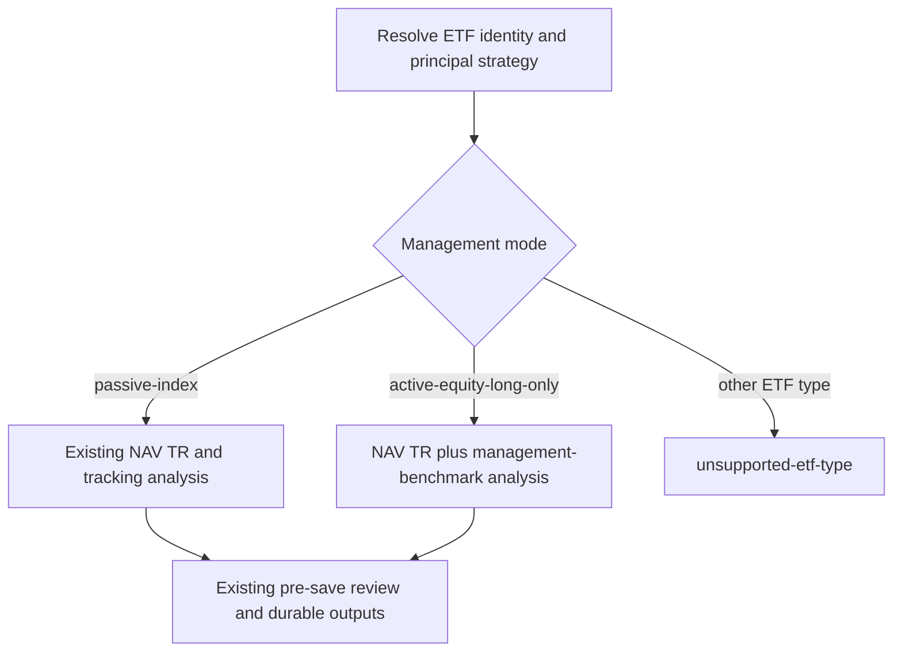

# Active Equity ETF Performance Design

**Date:** 2026-08-17
**Status:** Draft for user review
**Decision:** Extend `check-etf-performance` with an `active-equity-long-only`
branch while preserving the existing passive-index branch and Trello result
envelope.

## Goal

Allow the ETF performance pipeline to process active long-only equity ETFs such
as DISV, screen them by comparable `NAV Total Return`, and evaluate evidence of
active management value without treating raw high return as proof of manager
skill.

## Scope

Supported performance classifications become:

- `passive-index`: passive, index-tracking equity ETF under the existing rules.
- `active-equity-long-only`: an actively managed ETF whose principal strategy
  is long-only public-equity ownership, including systematic/factor-active and
  fundamental stock-selection approaches.

The performance workflow continues to reject bond, commodity, currency,
multi-asset, leveraged, inverse, defined-outcome, covered-call, option-income,
single-stock option, and other derivative-heavy ETFs. Those funds retain the
existing `unsupported-etf-type` item-level result.

This change applies to `check-etf-performance` only. The broader
`official-source-etf-research` v1 deep-dive workflow remains passive/index-only
until it receives its own active-fund research design. The change does not
claim portfolio fit or recommend a fund.

## Architecture

Keep one public `$check-etf-performance <TICKER>` entry point and classify the
fund before collecting its performance history:



The Trello skills require no routing change. `trello-etf-processing` continues
to invoke `check-etf-performance` once and consume the same seven-field
`trello_handoff`; `trello-etf-result` continues to treat a successful durable
write as `PASS` and excluded fund structures as `unsupported-etf-type`.

## Classification Contract

Use an official prospectus or issuer regulatory document to identify:

- canonical exchange-qualified `entity_key` and fund name;
- active versus passive management mode;
- principal asset class and whether long equity is the primary exposure;
- derivatives policy and whether derivatives materially define the payoff;
- investment process subtype: `systematic-active`, `fundamental-active`, or
  `other-active`;
- named adviser/team and management-tenure continuity when disclosed.

An active fund is eligible only when long equity is the principal return
source and derivatives are incidental implementation or risk-management tools.
If the payoff is materially options-based, leveraged, buffered, inverse,
single-stock, or multi-asset, return `unsupported-etf-type`. Ambiguous
classification is an item hard-data gap rather than an inferred eligibility
decision.

## Benchmark Contract

Active management evidence must use a pre-existing official comparator rather
than a benchmark selected after observing performance. Resolve benchmarks in
this order:

1. the official performance-table index explicitly described as having a
   similar investment universe or strategy;
2. the issuer-designated primary comparative benchmark aligned with the
   strategy;
3. the official broad-market benchmark when no closer official comparator is
   disclosed.

Record the selected comparator as `management_benchmark` and preserve other
official indexes as metadata. Keep `S&P 500 Total Return` as a common reference
under the existing convention, but never use it as evidence of manager skill
unless it is also the strategy-appropriate official comparator. Disclose index
changes, currency, net/gross dividend treatment, and period mismatches.

## Return and Management Evidence

Use official `NAV Total Return` before investor taxes and after fund expenses.
Do not mix it with market-price or price-only return. For active funds, add:

- fund and management-benchmark CAGR over identical endpoints;
- `Excess CAGR = Fund CAGR - Management Benchmark CAGR` in percentage points;
- annual active return for compatible calendar rows:
  `Fund NAV TR - Management Benchmark TR`;
- annual outperformance hit rate over complete comparable years;
- cumulative relative wealth when endpoints are available:
  `(1 + Fund cumulative return) / (1 + Benchmark cumulative return) - 1`;
- fund and benchmark max drawdown, downside capture, tracking error, and
  `Information Ratio` only when compatible monthly or daily total-return data
  make each calculation reproducible;
- expense ratio, turnover, benchmark or strategy changes, and management-team
  continuity as interpretation constraints.

Do not call arithmetic excess return `alpha`. Regression alpha may be reported
only when the workflow has a documented factor model, compatible periodic
observations, and reproducible regression output; that is not required in this
version.

## Track Record and Evidence Labels

Use comparable elapsed history, not the number of observations alone:

- less than three years: `insufficient track record`;
- at least three but less than five years: `provisional evidence`;
- at least five years: `established track record`.

Return evidence is:

- `positive` when excess CAGR is positive and the complete-year hit rate is at
  least 50%;
- `positive return-only` when excess CAGR is positive but a compatible hit rate
  is unavailable;
- `negative` when excess CAGR is non-positive and the hit rate is below 50%;
- `negative return-only` when excess CAGR is negative but a compatible hit
  rate is unavailable;
- `mixed` when excess CAGR and hit rate point in different directions, excess
  CAGR is exactly zero without a negative hit-rate signal, or the supported
  evidence does not satisfy another label;
- `insufficient` when fewer than three comparable elapsed years or no verified
  management-benchmark return is available.

Risk-adjusted evidence is a separate field. When drawdown, downside capture,
or information ratio cannot be verified, state `risk-adjusted evidence not
verified`; do not upgrade return-only evidence into a claim of manager skill.
Attribute evidence to the fund strategy/adviser process unless verified manager
tenure supports a narrower individual-manager statement.

## Output and Durable Files

Preserve the existing Thai-first performance-page structure. Add these active
fields under `Performance check`:

```text
management_mode: active-equity-long-only
active_process: systematic-active|fundamental-active|other-active
management_benchmark: <official strategy-aligned comparator>
track_record: insufficient|provisional|established
management_evidence: positive|positive return-only|mixed|negative|negative return-only|insufficient
risk_evidence: positive|mixed|negative|not-verified
```

For active funds, replace passive tracking commentary with an `Active
management read-through` section covering excess return, consistency,
risk-adjusted evidence, fees, turnover, and process/manager continuity. The
dated source batch must map every active classification and benchmark claim to
official evidence and retain the profile-specific verification audit lines.

`ETF Performance Index.md` may include active rows, but must expose management
mode and must not mix unequal periods or return bases in a ranking. Preserve
the existing reproducible passive `2016-2025` ranking as historical output.
Future mixed-universe screens must rank active and passive funds only inside
the same complete-calendar window and show active management evidence
separately from raw TR rank.

## Implementation Boundaries

Modify the user-level `check-etf-performance/SKILL.md` and its sibling
`workflow.md`. Update `agents/openai.yaml` only if its interface text becomes
inconsistent with the expanded trigger and scope. Add a deterministic contract
test inside that skill when practical.

Update project `AGENTS.md` so its ETF performance section permits active
long-only equity while its `official-source-etf-research` and other ETF v1
routes remain passive/index-only. Do not alter the Trello skill contracts or
the seven-field handoff. Do not pre-create a DISV performance page or rewrite
its historical blocked source record during implementation; the requeued
scheduled run owns fresh research, review, and durable output.

## Review Gate Changes

Extend the existing evidence packet and reviewer checklist with:

- `management_mode`, active-process subtype, and eligibility evidence;
- selected `management_benchmark`, selection reason, return basis, currency,
  and benchmark-change history;
- active-return, excess-CAGR, hit-rate, and relative-wealth calculations;
- elapsed track-record classification;
- return-evidence and risk-adjusted-evidence labels;
- manager/team continuity and attribution caveats.

All existing `interactive-delegated` and `scheduled-inline` boundaries remain
unchanged. A scheduled run still performs research and the complete pre-save
check inline and records:

```text
verification_mode: scheduled-local
reviewer_dispatch: not-attempted-by-design
```

## DISV Retry Procedure

Requeue only the exact DISV child card that was blocked for active management:

1. Finish and validate the workflow changes before touching Trello.
2. Resolve the exact card and directly confirm its current list is `Blocked`,
   its title is `DISV`, and its description preserves valid `workflow`,
   `parent_ari`, and `ticker` identity.
3. Remove stale `result_status`, `result_scope`, `result_code`,
   `result_reason`, `durable_write`, and `confirmation` lines while preserving
   all other card text.
4. Add `retry_reason: active-equity-long-only-support-enabled` and move the
   exact card to `Ready for AI`.
5. Directly reread the card and report only the confirmed final lane and
   description state. Do not claim that research or a durable write succeeded;
   the next scheduled pipeline run owns those outcomes.

If the search resolves zero or multiple DISV children, identity metadata is
invalid, the card is no longer in `Blocked`, or a Trello mutation cannot be
confirmed, stop without moving another card.

## Failure Handling

- Missing official active/passive or asset-class evidence:
  `item-hard-data-gap`.
- Eligible active equity with irreconcilable performance or benchmark data:
  `item-hard-data-gap` or `item-downstream-error` according to the existing
  envelope rules.
- Unsupported structure: `unsupported-etf-type` and move the child to
  `Blocked`.
- Pre-save non-pass: `item-pre-save-non-pass` and no durable write.
- Trello, authentication, list, configuration, claim-state, or contradictory
  result failures retain global-stop behavior.

## Validation Strategy

Validate the skill metadata and references with `quick_validate.py`, then run
static contract checks for these fixtures:

1. DISV-like systematic active long-only equity fund is eligible and requests
   management-benchmark evidence rather than returning unsupported type.
2. A passive index ETF follows the existing output and benchmark path without
   active-only fields becoming mandatory.
3. A covered-call, leveraged, or derivative-heavy active ETF remains
   `unsupported-etf-type`.
4. An active equity fund with less than three years is saved with
   `insufficient track record` and no manager-skill claim.
5. Missing compatible benchmark history produces an explicit gap and does not
   fabricate excess return, hit rate, or alpha.
6. `scheduled-inline` continues to prohibit all worker/reviewer dispatch and
   emits the exact local-verification lines.
7. The seven-field Trello handoff and result-router decision matrix remain
   unchanged.

Inspect `git status --short`, stage only files in this change, preserve existing
unrelated ETF performance work, and commit project-owned changes. Requeue DISV
only after every applicable validation passes.

## Acceptance Criteria

1. `check-etf-performance` supports both passive index-tracking equity ETFs and
   active long-only equity ETFs through explicit classification branches.
2. Raw high TR is separated from strategy-appropriate benchmark excess return,
   consistency, risk evidence, fees, and track-record maturity.
3. Unsupported ETF structures and all Trello global-stop rules are unchanged.
4. DISV no longer fails solely because it is actively managed; it may still
   block for a genuine source, benchmark, review, or downstream failure.
5. Passive ETF behavior and the existing scheduled-inline execution boundary
   remain backward compatible.
6. The exact DISV card is requeued only after validation and its final Trello
   state is confirmed.
